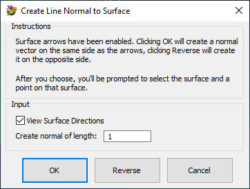
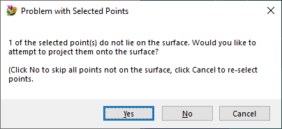

# Femap---Create-Line-Normal-to-Surface
Pick a surface and some points to create a straight line normal to the surface at each of the selected points.

See also: [How to use Femap Scripts](https://github.com/aaronjasso/How_to_use_Femap_Scripts) and [The List of my Femap Scripts](https://github.com/aaronjasso/My-Femap-Scripts)

---
### Overview
The program adds a feature that is missing but sorely needed in Femap: The ability to create a line normal to a surface. The program enables surface normal arrows so the user can choose which side of the surface to create the normal. A length can also be entered if the default length of 1 is not wanted. The user then selects a surface and a number of points, and the normal is created at each of the points.

### Detailed Instructions
The initial dialog box is shown below.

**View Surface Directions** If you want to turn off the surface directions arrows, uncheck this option

**Create normal of length** The default length of the normal is 1, but you can change that here

**OK Button** Will create the normal on the same side as the surface direction arrows

**Reverse Button** will create the normal on the opposite side of the surface direction arrows

**Cancel** turns off surface direction arrows and exits the program

After clicking OK or Reverse, select a surface and then select any number of points.

### If any of the points do not lie on the surface
You will see the following dialog box:

**Yes** will attempt to project the point(s) that don't already lie on the surface onto the surface. If any of these projections fail, you will be notified and then the program will continue only with the valid points.

**No** will simply skip all points that don't lie on the surface.

**Cancel** will return you to the point selection dialog, where you can pick new points.
